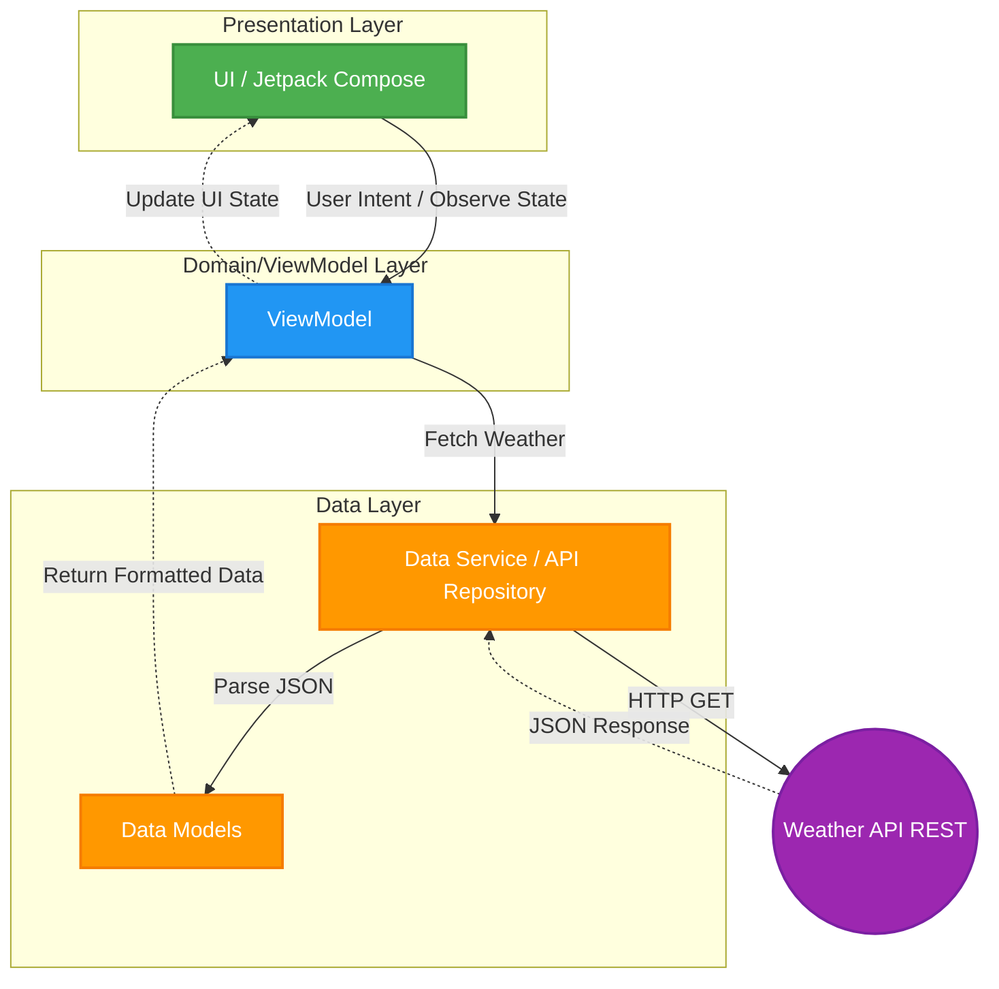

# Weather App API 🌤️

Une application météo Android native développée en Kotlin, illustrant les bonnes pratiques de développement modernes avec Jetpack Compose et l'utilisation d'une Clean Architecture basée sur le modèle MVVM (Model-View-ViewModel).

## 🏗️ Clean Architecture & Design Pattern

Le projet suit les principes de la **Clean Architecture** couplés au pattern **MVVM**, favorisant une séparation claire des responsabilités, la maintenabilité du code et sa testabilité. L'architecture est divisée en plusieurs couches distinctes, observables à travers l'organisation des packages :

- **`ui/` (Présentation)** : Contient toutes les vues développées avec Jetpack Compose. Cette couche n'a aucune logique métier, elle se contente d'afficher les états (States) fournis par le ViewModel et de capter les interactions utilisateur (Events).
- **`view-model/` (Logique de Présentation)** : Fait le pont entre les données et l'interface utilisateur. Le ViewModel expose les données (via LiveData/StateFlow) et gère la logique de l'écran.
- **`model/` (Domaine)** : Contient les entités métiers et modèles de données purs utilisés à travers l'application.
- **`data-service/` (Données)** : Gère la récupération des données (ici, via l'API REST). Elle masque les détails d'implémentation (Retrofit, API Keys) au reste de l'application.

## 📊 High Level Diagram

Voici le diagramme de flux de données de haut niveau illustrant la communication entre les couches de l'application :

## 🛠️ Stack Technique

Le projet repose sur les technologies et bibliothèques standard recommandées pour le développement Android moderne :

- **Langage** : [Kotlin](https://kotlinlang.org/)
- **UI Framework** : [Jetpack Compose](https://developer.android.com/jetpack/compose)
- **Architecture Components** : ViewModel, LiveData
- **Réseau** : [Retrofit2](https://square.github.io/retrofit/) avec adaptateurs Scalars et [Gson](https://github.com/google/gson) pour le parsing JSON
- **Chargement d'Images** : [Coil Compose](https://coil-kt.github.io/coil/compose/)
- **Tests** : JUnit, Espresso, Compose UI Testing

## ⚙️ Configurations & Prérequis

Les paramètres de build et configurations globales du projet sont définis dans les fichiers `build.gradle.kts` :

- **Minimum SDK** : 24 (Android 7.0 Nougat)
- **Target SDK** : 36
- **Compile SDK** : 36
- **Java Version** : Java 11
- **Compose Compiler** : Activé
- **Système de Build** : Gradle (Kotlin DSL)

### Pour lancer le projet :

1. Clonez ce dépôt sur votre machine locale.
2. Ouvrez le projet avec **Android Studio**.
3. Assurez-vous d'avoir inséré votre clé API météo valide dans le fichier `data-service/API_KEY.kt` (ou tout autre emplacement de configuration prévu).
4. Lancez le build Gradle (Sync Project with Gradle Files).
5. Compilez et exécutez sur un émulateur Android (API 24+) ou un appareil physique.
